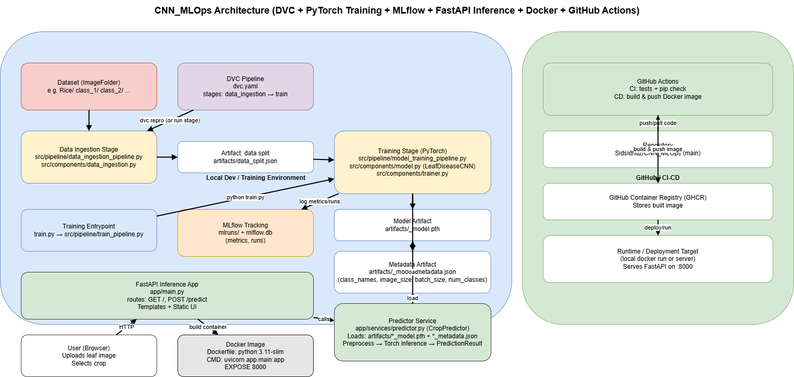

# Crop Disease Classifier

A PyTorch-based crop disease classification project with a modular training pipeline, DVC stage tracking, MLflow experiment logging, a FastAPI web app for inference, Docker packaging, and GitHub Actions automation.

## What this project does

- Trains an image classifier using transfer learning with EfficientNet-B0.
- Uses a file-based artifact flow so each stage passes data to the next through saved files.
- Tracks the training pipeline with DVC.
- Logs metrics and model runs with MLflow.
- Serves predictions through a simple FastAPI web UI.
- Builds and publishes a Docker image through GitHub Actions CD.

## Project structure

```text
app/                    FastAPI app and templates
artifacts/              Local outputs from ingestion, training, and metrics
src/components/         Core building blocks for data, model, and trainer
src/pipeline/           CLI pipeline entrypoints for ingestion and training
tests/                  Smoke tests for CI
train.py                Training entrypoint
Dockerfile              Container build for the FastAPI app
dvc.yaml                DVC pipeline definition
.github/workflows/      CI and CD workflows
```

## Prerequisites

- Python 3.11 recommended
- Git
- Optional but useful: DVC, Docker, and GitHub account
- A dataset organized in `ImageFolder` format

### Dataset format

The training code expects an image classification dataset arranged like this:

```text
Rice/
  class_1/
    image1.jpg
    image2.jpg
  class_2/
    image3.jpg
  class_3/
    image4.jpg
```

Each class must be a separate folder under the dataset root.

## Important note about the dataset path

The current `dvc.yaml` uses this dataset location:

```text
G:/Crop Diseases Dataset/Crop Diseases/Crop___Disease/Rice
```

If your dataset is stored somewhere else, update the path in `dvc.yaml` before running DVC.

## Setup

### 1. Clone the repository

```bash
git clone <your-repo-url>
cd CNN_MLOps
```

### 2. Create and activate a virtual environment

Windows PowerShell:

```powershell
python -m venv .venv
.\.venv\Scripts\Activate.ps1
```

macOS/Linux:

```bash
python3 -m venv .venv
source .venv/bin/activate
```

### 3. Install dependencies

```bash
python -m pip install --upgrade pip
pip install -r requirements.txt
```

## How the training flow works

The training pipeline is split into two stages:

1. `data_ingestion`
   - Reads the dataset
   - Splits it into train and validation indices
   - Saves `artifacts/data_split.json`

2. `train`
   - Reads the split artifact
   - Trains EfficientNet-B0
   - Saves the trained model and metadata into `artifacts/`
   - Logs metrics to `artifacts/metrics.json`
   - Logs runs to MLflow

## Run the pipeline with DVC

If DVC is installed, reproduce the pipeline with:

```bash
dvc repro
```

This will run the ingestion stage and the training stage in order.

## Run training manually

### Ingest data only

```bash
python -m src.pipeline.data_ingestion_pipeline \
  --data-dir "G:/Crop Diseases Dataset/Crop Diseases/Crop___Disease/Rice" \
  --artifacts-dir artifacts \
  --split-file-name data_split.json \
  --image-size 224 \
  --batch-size 16 \
  --val-split 0.2 \
  --seed 42
```

### Train only

```bash
python -m src.pipeline.model_training_pipeline \
  --split-file-path artifacts/data_split.json \
  --output-model-path artifacts/rice_model.pth \
  --epochs 30 \
  --learning-rate 0.0001
```

### Full training entrypoint

```bash
python train.py \
  --data-dir "G:/Crop Diseases Dataset/Crop Diseases/Crop___Disease/Rice" \
  --output-model-path artifacts/rice_model.pth \
  --image-size 224 \
  --batch-size 16 \
  --val-split 0.2 \
  --seed 42 \
  --epochs 30 \
  --learning-rate 0.0001
```

## Run the FastAPI app locally

After training has produced the model files in `artifacts/`, start the app with:

```bash
uvicorn app.main:app --reload
```

Then open:

```text
http://127.0.0.1:8000
```

The web page lets you:

- choose a crop from a dropdown
- upload an image
- get the prediction on the same page

## Using the prediction UI

1. Open the local FastAPI app in your browser.
2. Select the crop from the dropdown.
3. Upload a leaf image.
4. Click **Predict**.
5. The predicted disease and confidence will appear on the same page.

## Docker

Build the inference image:

```bash
docker build -t cnn-mlops-fastapi .
```

Run the container:

```bash
docker run -p 8000:8000 cnn-mlops-fastapi
```

Then open:

```text
http://127.0.0.1:8000
```

## CI and CD

This repository includes GitHub Actions workflows:

- **CI** in `.github/workflows/ci.yml`
  - installs dependencies
  - runs smoke tests
  - compiles Python sources
  - checks packages with `pip check`

- **CD** in `.github/workflows/cd.yml`
  - runs after CI succeeds on `main`
  - builds the Docker image
  - pushes the image to GitHub Container Registry

## Artifacts generated by the project

The project writes the following local artifacts:

- `artifacts/data_split.json`
- `artifacts/rice_model.pth`
- `artifacts/rice_model_metadata.json`
- `artifacts/metrics.json`
- MLflow tracking files in `mlruns/`

These are runtime outputs and are usually regenerated locally.

## Testing

Run the smoke tests locally:

```bash
python -m unittest discover -s tests -p "test_*.py"
```

## System Architecture

The following diagram shows the end-to-end MLOps workflow of the Crop Disease Classification system.

<p align="center">
  
</p>


## Troubleshooting

### `dvc repro` fails

- Check that the dataset path in `dvc.yaml` is correct on your machine.
- Make sure the dataset is in `ImageFolder` format.
- Confirm that the Python environment has the required packages installed.

### FastAPI starts but no crops appear

- Make sure training has already created `artifacts/<crop>_model.pth` and the matching metadata file.
- Confirm that the `artifacts/` folder still contains the model files.

### Prediction fails with missing model or metadata

- Re-run training so the model and metadata files are regenerated.
- Make sure the crop name matches the saved artifact names.

## License

See [LICENSE](LICENSE) for license details.
